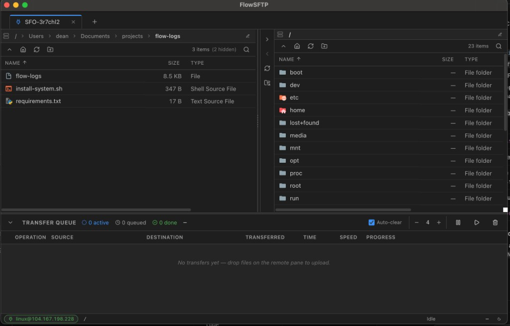

# FlowSFTP

Cross-platform desktop client for file transfers (WinSCP-style). **Milestone M1** includes SFTP: connect, browse remote, single-file upload and download.

## Screenshot



## Stack

- Electron + electron-vite + Vite + Vue 3 + TypeScript + Pinia + Vue Router
- SFTP via `ssh2-sftp-client` (main process only)
- IPC validated with Zod; `window.api` exposed from preload

## Multi-window

Each **File → New window** (or **Ctrl/Cmd+N**) opens another independent commander window. SFTP sessions are scoped to the window that logged in; closing a window drops its connections. The in-app **File** menu (below the OS menu bar) offers the same actions.

## Run

```bash
git clone https://github.com/stackblaze/flowsftp.git
cd flowsftp
npm install
npm run dev
```

## Build

```bash
npm run build
npm run build:mac   # or :win / :linux
```

## Security note (M1)

Host keys are accepted without TOFU UI (see `src/main/sftp/sftp-manager.ts`). Production hardening is planned for milestone M4.

## Docs

- [Keyboard shortcuts](./docs/shortcuts.md) (M1 vs future milestones)
